# Code Copilot on CodeSearchNet

Small Python coding assistant: **retrieve → optional keyword tool → abstain / generate → cite**.

Built for *AI and Deep Learning Models Development* (Applied Languages Model), Google & Reichman AI Tech School (Dr. Barak Or, Orr Zwebner).

**Dataset:** [CodeSearchNet](https://huggingface.co/datasets/code-search-net/code_search_net) (Python) — Husain, H., Wu, H.-H., Gazit, T., Allamanis, M., & Brockschmidt, M. (2019). *CodeSearchNet challenge: Evaluating the state of semantic code search*. [arXiv:1909.09436](https://arxiv.org/abs/1909.09436). ([GitHub](https://github.com/github/CodeSearchNet))

| | |
|---|---|
| **Author** | Tal Matsil |
| **Dataset** | [CodeSearchNet](https://huggingface.co/datasets/code-search-net/code_search_net) (Python) |
| **Generator** | `Qwen/Qwen2.5-Coder-3B-Instruct` (**base**, no LoRA shipped) |
| **Retriever** | `sentence-transformers/all-MiniLM-L6-v2` + Chroma |
| **Notebook** | [`codesearchnet_copilot_full.ipynb`](codesearchnet_copilot_full.ipynb) |

### Headline results

| Signal | Number |
|---|---|
| Retrieval on TEST (docstring→code, n=150) | **Hit@1 82.0%** · Hit@5 94.7% · MRR 0.873 |
| Agent end-to-end on TEST (n=60) | **83.3%** hit & answered |
| LoRA vs base (TEST, n=40, 2 LLM judges) | LoRA ↑ ROUGE-L; **both judges prefer base** |
| Decision | Ship **base** generator + RAG + confidence abstention |

---

## Problem

Given a natural question about code, return a grounded explanation of the right function — or say “I don’t know” — using a public function-level corpus (CodeSearchNet Python), without assuming access to a private monorepo checkout at inference time.

## System overview

```text
query
  → embed (MiniLM) + Chroma top-k  (+ optional repo filter)
  → optional keyword tool over candidates
  → confidence gate (distance threshold, calibrated on val)
  → abstain  OR  generate with Qwen2.5-Coder-3B-Instruct
  → cite source chunk (repo / path / function)
```

**Why no LoRA in production path:** across 16 trained variants, automatic overlap metrics often improved while GPT/Gemini judges scored the base model higher. Live TEST reconfirmed that split. The agent therefore loads the base checkpoint only.

---

## Dataset

| Field | Value |
|---|---|
| Source | CodeSearchNet Python ([paper](https://arxiv.org/abs/1909.09436)) |
| Splits | Official `train` / `validation`→`val` / `test` (**repo-disjoint**) |
| Unit | One function: docstring + code |
| Pipeline use | Full splits for filter → chunk → embed → Chroma |
| LoRA data | Repo-capped, detail-filtered subsample of `train` (~400–4k depending on run; live retrain uses ~1.2k) |
| Eval holdout | `test` untouched until Section 14 |

Preprocessing: empty/placeholder docs, near-duplicates, non-English docs (`langdetect`), then a **512-token** doc+code budget (MiniLM tokenizer).

---

## Methods

### Retrieval (RAG)

- Embedder: `all-MiniLM-L6-v2`
- Store: persistent **Chroma** (metadata includes stripped code for generation)
- Metrics: Hit@k (k=1,5,10), MRR; BM25 and paraphrase probes as sanity checks

### Generation + LoRA study

- Base: `Qwen/Qwen2.5-Coder-3B-Instruct` (chosen after an 8-model screen; `code→doc` preferred over `doc→code`)
- Adapters: PEFT LoRA; strongest live candidate `r=8`, `α=16`, `lr=1.5e-4`, 2 epochs, attn modules `q/k/v/o_proj`, ~1.2k detail-filtered rows
- Scoring: ROUGE-L, embedding cosine, GPT-4o-mini judge, Gemini judge (1–5)

### Agent

Minimal tool loop (not a multi-agent planner): retrieve → optional grep-style keyword tool → abstain/generate → cite. Confidence threshold calibrated on **val**, evaluated on **test**.

---

## Results, plots, and qualitative examples

Figures below are exported from the executed notebook (`docs/figures/`). Full tables and interactive outputs remain in the notebook.

### 1. Retrieval quality

**Self-retrieval probe** (Section 5; corpus 15k, 300 docstring queries):

| Check | Hit@1 | Hit@5 | Hit@10 | MRR |
|---|---:|---:|---:|---:|
| Docstring → embed | 91.0% | 97.7% | 98.3% | 0.938 |
| BM25 (lexical) | 98.7% | 99.7% | 99.7% | 0.991 |
| Paraphrased NL query (n=8) | **0.0%** | 0.0% | 0.0% | 0.000 |

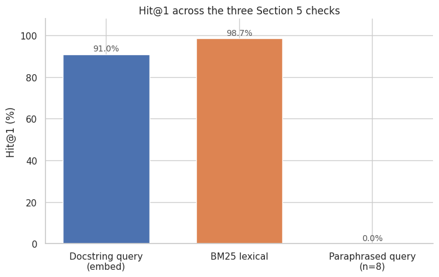

**Held-out TEST retrieval** (doc→code, n=150):

| Metric | Value |
|---|---:|
| Hit@1 | **0.820** |
| Hit@5 | 0.947 |
| Hit@10 | 0.953 |
| MRR | 0.873 |

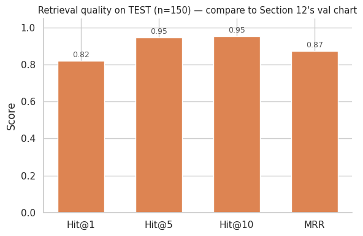

**Takeaway:** docstring-as-query looks strong (and BM25 is even stronger — lexical overlap does a lot of the work). Rewording the same intents as ordinary questions collapses Hit@1 to 0/8 on the probe. That gap drives the abstention gate.

### 2. Model screen (why Qwen + code→doc)

Eight small code LMs × two directions on 20 samples. `code→doc` was the higher-quality direction for every model (mean GPT judge ~2.94 vs ~2.29). Selected generator: **Qwen2.5-Coder-3B-Instruct**.

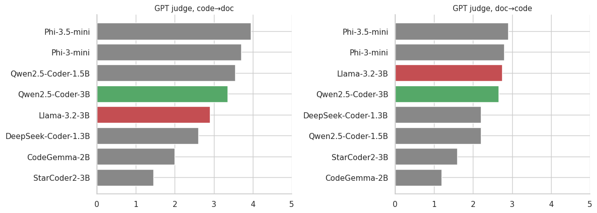

### 3. LoRA investigation — metric paradox

**16 trained variants** (ranks, LR, epochs, data filters/scale, regularization). Pattern is stable:

- **ROUGE-L / semantic similarity:** most runs ≥ base (green)
- **GPT + Gemini judges:** **every** run < base (red); GPT decline bootstrap CIs entirely below zero

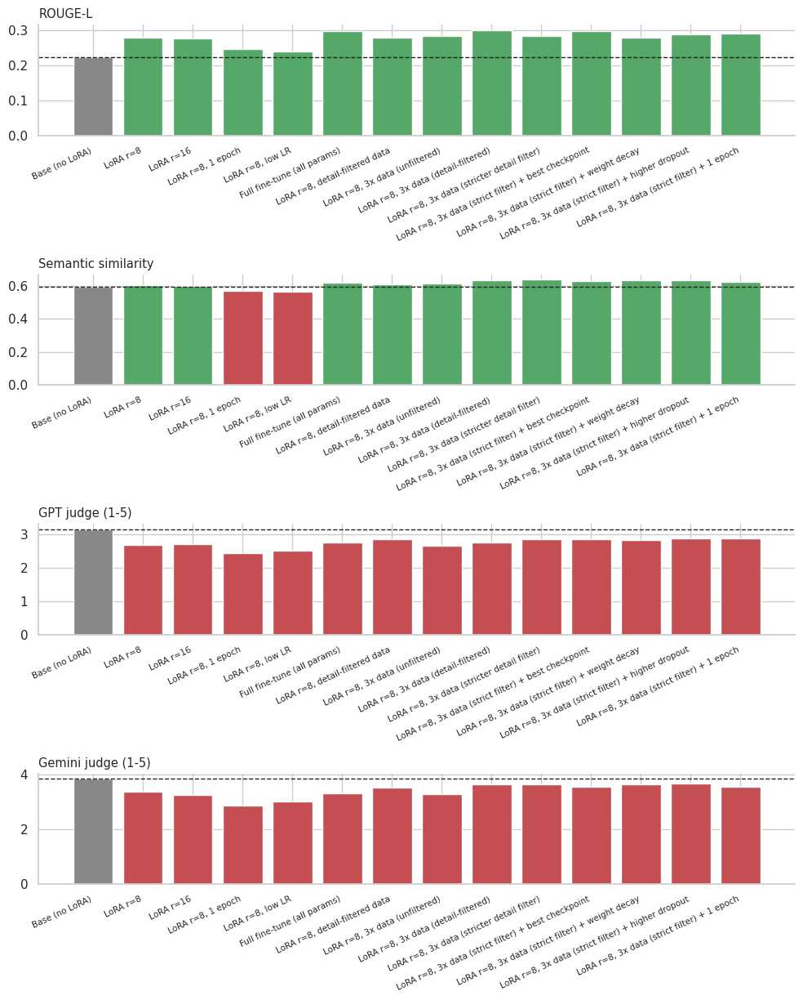

Follow-ups (more data / rewritten targets) did not reverse the judge decline:

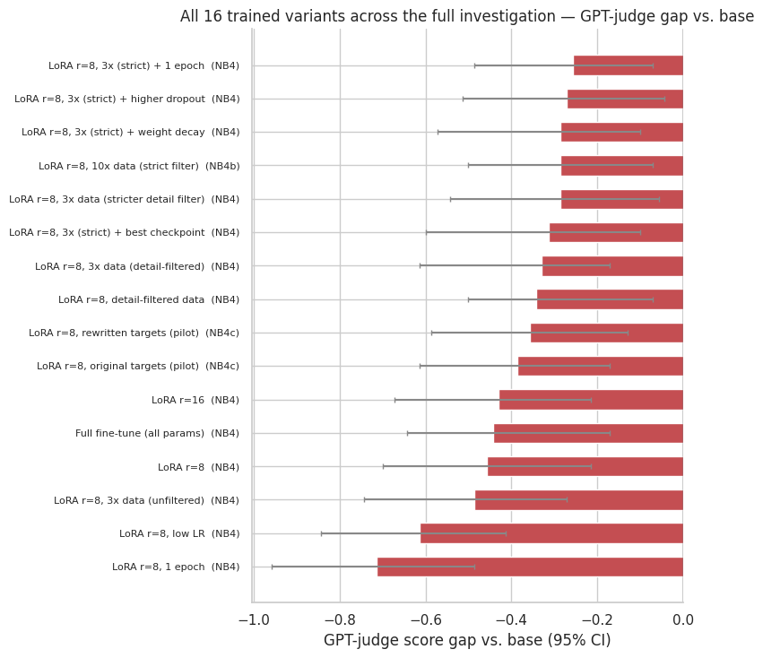

Live retrain of the composite leader (`r=8`, 3× detail-filtered) — training curve:

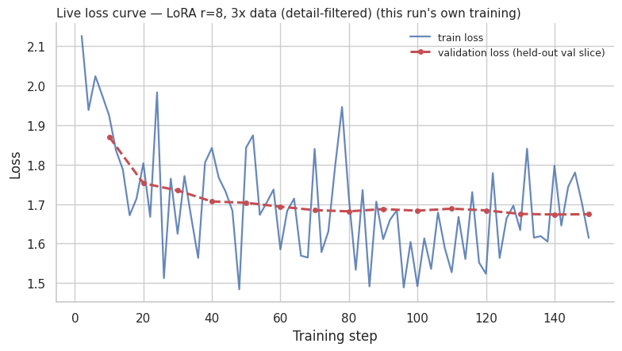

### 4. Base vs LoRA scorecards (VAL + TEST)

**Historical VAL** (original project scorecard):

| Model | ROUGE-L | Semantic sim. | GPT (1–5) | Gemini (1–5) |
|---|---:|---:|---:|---:|
| **Base — shipped** | 0.222 | 0.594 | **3.143** | **3.857** |
| Best LoRA candidate | **0.300** | **0.634** | 2.757 | 3.643 |

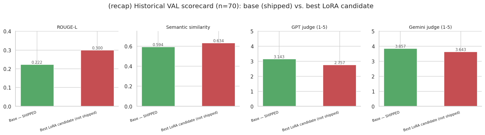

**Live TEST** (n=40, this notebook run; same recipe, held-out repos):

| Model | ROUGE-L | Semantic sim. | GPT (1–5) | Gemini (1–5) |
|---|---:|---:|---:|---:|
| **Base (no LoRA)** | 0.211 | 0.633 | **3.175** | **4.100** |
| LoRA r=8, 3× detail-filtered | **0.300** | **0.640** | 3.050 | 3.850 |

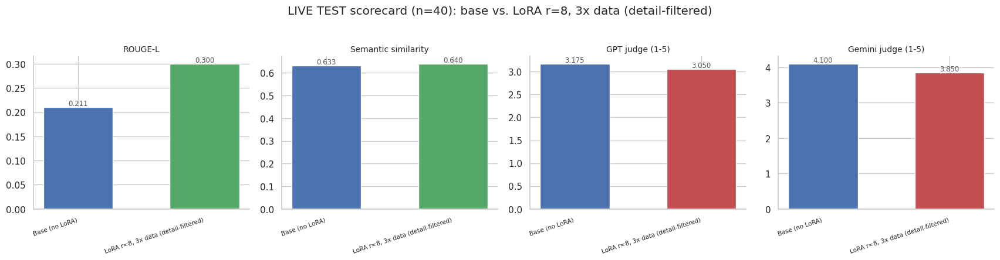

**Decision rule used:** judge metrics are decisive for “is this a better explanation?” Automatic overlap is reported but not used to pick the shipped model.

### 5. Agent end-to-end

Confidence gate calibrated on val; batch eval treats docstring-as-query as ground truth and counts four buckets:

| Split | n | hit & answered | hit & abstained | miss & answered | miss & abstained |
|---|---:|---:|---:|---:|---:|
| VAL | 60 | **78.3%** (47) | 6.7% (4) | 10.0% (6) | 5.0% (3) |
| TEST | 60 | **83.3%** (50) | 3.3% (2) | 8.3% (5) | 5.0% (3) |

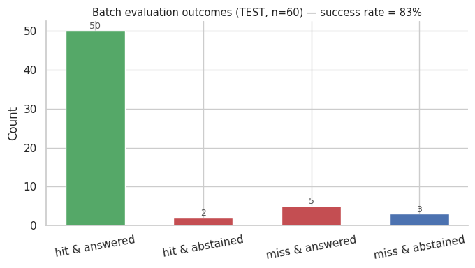

Retrieval Hit@k on the agent’s store (val calibration view):

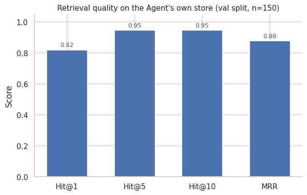

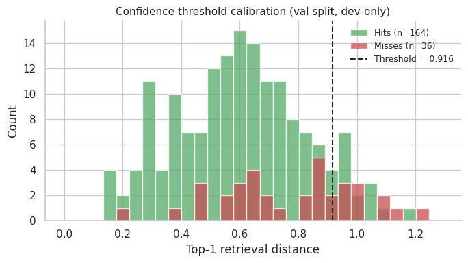

### 6. Qualitative behavior (agent)

Worked examples from Section 12 (same live Chroma store):

| # | Scenario | Outcome |
|---|---|---|
| 1 | Docstring-style query with a close neighbor in-store | **Answer + citation** (distance under threshold) |
| 2 | Natural-language question scoped to one large repo | **Abstain** — nearest chunk above threshold |
| 3 | Same repo + keyword tool | Tool finds keyword hits among candidates, but best distance still too far → **abstain** |
| 4 | Question with no answer in CodeSearchNet | Nearest neighbor still above threshold → **abstain** |

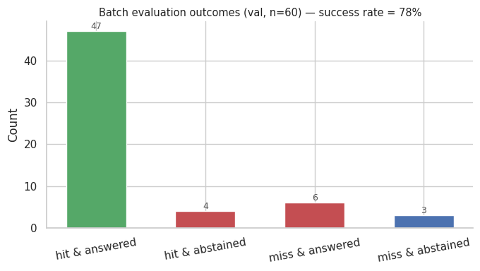

Design intent: a wrong confident explanation is worse than an honest skip. Grep can *rank among* candidates; it cannot invent a strong semantic match.

---

## Limitations

1. **Query distribution shift** — benchmark Hit@k is dominated by docstring-like queries; ordinary paraphrases are much harder (Section 5 probe).
2. **Metric disagreement** — optimizing ROUGE-L alone would incorrectly ship LoRA; LLM judges reverse that ranking (and occasionally disagree with each other on *which* answers got worse).
3. **Small judge samples** — live TEST generation compare uses n=40; agent batch n=60. Direction is consistent with the 16-run history, but intervals are wide.
4. **No private-repo checkout** — agent tools operate over the indexed CodeSearchNet corpus / retrieved candidates, not an arbitrary local git tree.

---

## Notebook map

| Sections | Stage |
|---|---|
| 0–2 | Setup, load data, length distributions |
| 3–5 | Quality + token filters; retrieval reality check |
| 6–8 | Chunk table, official splits, embeddings + Chroma |
| 9–11 | Model screen, 16-run LoRA study + follow-ups, live retrain |
| 12–14 | Agent loop; VAL recap; live TEST scorecard |
| 15–17 | Summary, limitations, pointer to `experiments/` |

Staged predecessors live under [`experiments/`](experiments/).

---

## Setup

**Colab (recommended):** open `codesearchnet_copilot_full.ipynb` → Runtime → GPU → Run all.  
Optional secrets for Section 14 judges: `OPENAI_API_KEY`, `GEMINI_API_KEY`.

**Local:**

```powershell
python -m venv .venv
.\.venv\Scripts\Activate.ps1
pip install -r requirements.txt
```

Then run the notebook with a GPU if available. Artifacts write to `codesearchnet_copilot_full_artifacts/` (also packed as `codesearchnet_copilot_full_artifacts.zip`).

---

## Repository layout

```text
code-copilot/
  codesearchnet_copilot_full.ipynb
  codesearchnet_copilot_full_artifacts.zip
  docs/figures/                 # plots embedded in this README
  experiments/                  # staged notebooks
  requirements.txt
  README.md
```

---

## References

- Husain, H., Wu, H.-H., Gazit, T., Allamanis, M., & Brockschmidt, M. (2019). *CodeSearchNet challenge: Evaluating the state of semantic code search*. [arXiv:1909.09436](https://arxiv.org/abs/1909.09436)
- [CodeSearchNet on Hugging Face](https://huggingface.co/datasets/code-search-net/code_search_net) · [GitHub](https://github.com/github/CodeSearchNet)
